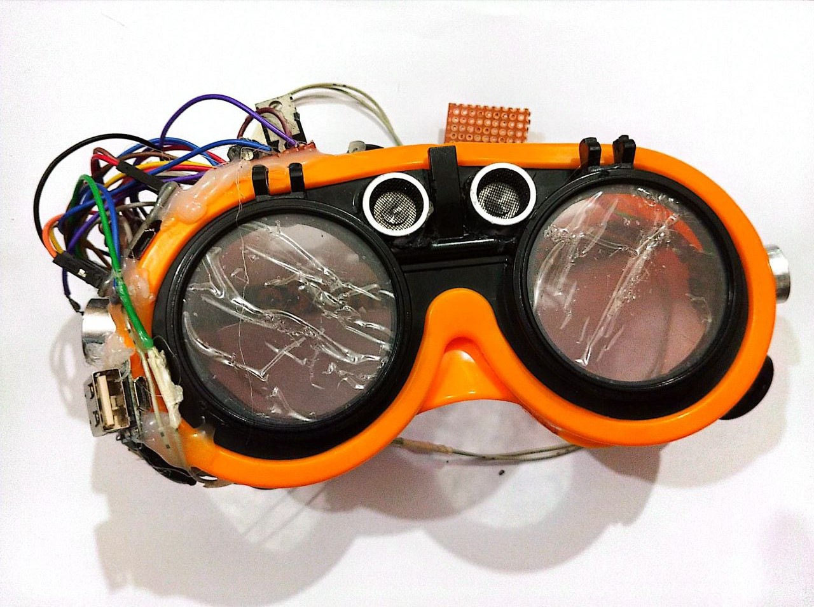
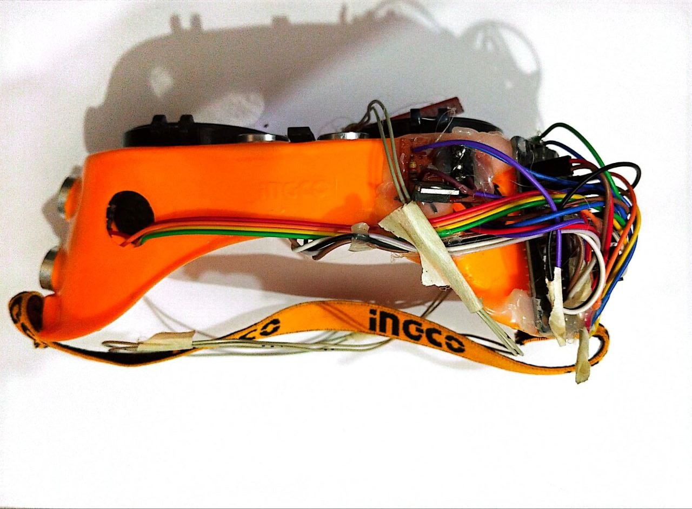

# Smart Command Based Eyeglass for Blind People.

Smart eyeglasses for the visually impaired represent a significant advancement in 
assistive technology, aiming to enhance the mobility and independence of 
individuals with visual impairments. By integrating ultrasonic sensors and Arduino 
microcontroller technology, these glasses offer real-time obstacle detection and 
notification capabilities. The use of ultrasonic sensors enables the glasses to detect 
obstacles in the user's path accurately. The incorporation of sensors on both the 
front and sides of the glasses provides comprehensive coverage, ensuring users 
are alerted to obstacles from all directions.

